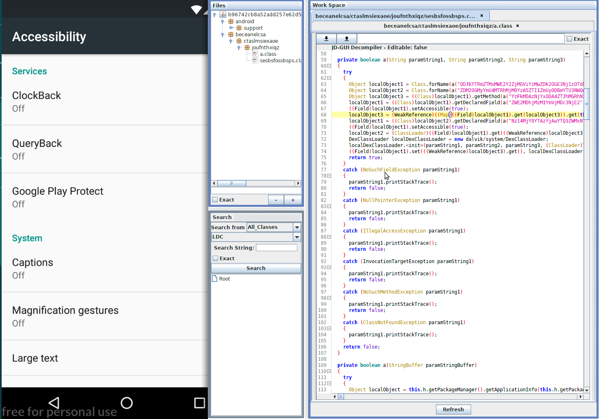

## MC2Extractor

### MC2Extractor is a script collection for extracting C2 server from a given Android malware

## Anubis Malware 
[anubis.py](./anubis.py)

```
/tmp/anubis » python3 anubis.py '~/platform-tools/adb' '~/apk/d2/' b96742cb8a52add257e62d533f0ff84ac8fef98e4ca0ba4a1bbf502e3296897d.apk

twitter:  https://twitter.com/ktaninzoowell
key:      flash1
c2:       http://92.63.197.108
```



## Fobus Malware 
[mazar.py](./mazar.py)
requirements: androguard 

```
/tmp/mazar » python2 mazar.py 93be0ce0b6e3c9f214aed5ac27541580d5a21cefde43118ce871f8dbf409eca8.apk 
http://195.161.62.107/index.php?action=command
```